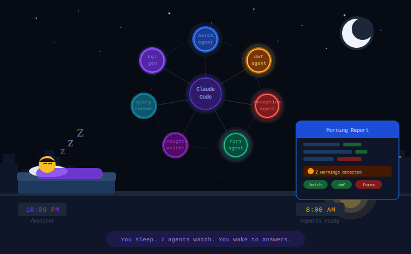

<div align="center">

# ◉ D365 Observability Hub

### Overnight AI Monitoring for D365 Finance & Operations

[](https://claude.ai/code)
[](https://azure.microsoft.com/en-us/products/monitor)
[](LICENSE)
[](https://github.com/prashantdce21MSFT/d365-observability-hub/releases)
[](https://dynamics.microsoft.com)

**You close your laptop. 7 AI agents wake up.**
**By the time your morning coffee is ready — the reports are already there.**



[Quick Start](#quick-start) · [What's New in v2.0](#whats-new-in-v20) · [Architecture](#architecture) · [How It Works](#how-it-works) · [Agents](#the-7-agents) · [Commands](#commands) · [Outputs](#outputs)

</div>

---

## What Is This?

D365 Observability Hub is a **Claude Code native** overnight monitoring system for Dynamics 365 Finance & Operations. It uses AI agent architecture to automatically query your Azure App Insights, detect performance issues, and write reports — while you sleep.

> **No server. No Node.js app. No API keys. No hardcoding. Just markdown files and Claude Code.**

### What It Monitors

| Domain | Source Table | What It Detects |
|--------|-------------|-----------------|
| **Batch Jobs** | customEvents | Slow jobs, failures, thread saturation, CPU/DTU throttling |
| **DMF** | customEvents | Failed exports, staging errors, slow jobs, aborted runs |
| **Exceptions** | exceptions | X++ errors, new exception types, batch correlations |
| **Forms** | pageViews | Slow form loads, P95/P99, active sessions, regional issues |

> All table names, event names, column names and field mappings are **discovered dynamically** — nothing is hardcoded.

---

## What's New in v2.0

### v1.0 — Hardcoded
```
batch-agent.md had:
  name == "BatchTaskFinished"          ← hardcoded event name
  tolong(customDimensions.elapsedMilliseconds)  ← hardcoded field
  > 60000                              ← hardcoded threshold
  ago(1h)                              ← hardcoded time window
  App ID: 9d57480a-...                 ← hardcoded connection
```

### v2.0 — Fully Schema-Driven
```
batch-agent.md now reads:
  name in (schema.domains.batch.events)           ← discovered at runtime
  tolong(customDimensions.{schema.domains.batch.durationField})  ← from schema
  > schema.thresholds.batch.slow_job_warning_ms   ← from thresholds.json
  ago({schema.lookbackWindow}m)                   ← from thresholds.json
  App ID from schemas/active.json only            ← never in agent files
```

### Key improvements in v2.0

| Feature | v1.0 | v2.0 |
|---------|------|------|
| Event names | Hardcoded in agent files | Discovered live from App Insights |
| Column names | Hardcoded in agent files | Discovered from customDimensions |
| Thresholds | Hardcoded in CLAUDE.md | `schemas/thresholds.json` — auto-generated |
| App ID | Hardcoded in every agent | `schemas/active.json` only |
| Status values | Hardcoded ("Finished","Error") | Discovered dynamically |
| Portability | D365 only | Any Azure App Insights resource |
| Auto dashboard | Manual only | Auto-generated after every cycle |
| schema-analyst | Reads pre-defined schema | Queries App Insights live at startup |

---

## Architecture

### How the schema flows

```
schemas/active.json          ← YOU fill this in (App ID + tenant only)
schemas/thresholds.json      ← auto-generated on first /load-schema
         │                      (edit to tune for your environment)
         │
         ▼
/load-schema → schema-analyst runs
         │
         ├── Queries App Insights live → discovers tables
         ├── Queries each table       → discovers event names
         ├── Queries each event       → discovers customDimensions fields
         └── Saves everything to schemas/parsed-schema.json
                    │
                    ▼
         parsed-schema.json  ← contains BOTH:
                               · thresholds (from thresholds.json)
                               · discovered schema (from live queries)
                    │
         ┌──────────┴──────────┐
         ▼                     ▼
   All 7 agents          query-runner
   read from here        reads App ID
   — no hardcoding       from here only
```

### How /monitor works every cycle

```
/monitor starts
    │
    ▼
Reads schemas/parsed-schema.json
    │
    ▼
4 specialist agents spawn in parallel
├── batch-agent    → queries customEvents using discovered batch events
├── dmf-agent      → queries customEvents using discovered DMF events
├── exception-agent → queries exceptions table
└── form-agent     → queries pageViews table
    │
    ▼
Reports written → reports/YYYY-MM-DD/{agent}-report-{timestamp}.md
    │
    ▼
Alerts written  → alerts/alert-{agent}-{timestamp}.json
                  (only when threshold breached)
    │
    ▼
Dashboard auto-generated → reports/dashboard.html  ← NEW in v2.0
    │
    ▼
Sleep 60 minutes
    │
    ▼
Repeat all night ↻
```

---

## Quick Start

### Prerequisites

- Node.js v18+ — [nodejs.org](https://nodejs.org)
- Azure CLI — [learn.microsoft.com/cli/azure](https://learn.microsoft.com/en-us/cli/azure/install-azure-cli)
- Anthropic API key — [console.anthropic.com](https://console.anthropic.com)
- Azure App Insights resource with D365 FO telemetry enabled

---

### Step 1 — Install Claude Code CLI

```bash
npm install -g @anthropic-ai/claude-code
claude --version   # confirm installed
```

---

### Step 2 — Set your Anthropic API key

Get your key from [console.anthropic.com](https://console.anthropic.com) → API Keys → Create Key

```bash
# Windows (permanent — survives restarts)
setx ANTHROPIC_API_KEY "sk-ant-your-key-here"

# Mac/Linux (add to ~/.bashrc or ~/.zshrc to make permanent)
export ANTHROPIC_API_KEY="sk-ant-your-key-here"
```

> **Windows:** Close and reopen your terminal after `setx` for the key to take effect.

---

### Step 3 — Login to Azure

```bash
az login --tenant YOUR_TENANT.onmicrosoft.com

# Confirm you are logged in
az account show --query user.name --output tsv
```

> The system uses Azure AD authentication via `az rest` — no App Insights API keys needed. Your existing `az login` session is all it requires.

---

### Step 4 — Clone the project

```bash
git clone https://github.com/prashantdce21MSFT/d365-observability-hub.git
cd d365-observability-hub
```

Or download the ZIP from [Releases](https://github.com/prashantdce21MSFT/d365-observability-hub/releases) and extract it.

---

### Step 5 — Create folder structure (if not cloned)

```bash
# Windows — run each line separately
mkdir .claude
mkdir .claude\agents
mkdir .claude\commands
mkdir schemas
mkdir reports
mkdir alerts
mkdir kql-cache
mkdir docs

# Mac/Linux
mkdir -p .claude/agents .claude/commands schemas reports alerts kql-cache docs
```

---

### Step 6 — Configure your App Insights connection

This is the **only file you need to edit manually**. Open `schemas/active.json` and fill in your real values:

```json
{
  "_comment": "Fill in your App Insights details. Run /load-schema after saving.",
  "appId": "YOUR_APP_INSIGHTS_APP_ID",
  "appName": "YOUR_APP_INSIGHTS_NAME",
  "resourceGroup": "YOUR_RESOURCE_GROUP",
  "tenant": "YOUR_TENANT.onmicrosoft.com",
  "azRest": "az rest --method post --url \"https://api.applicationinsights.io/v1/apps/YOUR_APP_INSIGHTS_APP_ID/query\" --headers \"Content-Type=application/json\" --body \"{\\\"query\\\": \\\"{query}\\\"}\""
}
```

Find your App ID:
```bash
az monitor app-insights component show \
  --app YOUR_APP_INSIGHTS_NAME \
  --resource-group YOUR_RESOURCE_GROUP \
  --query appId \
  --output tsv
```

Or in Azure Portal: **App Insights → YOUR_RESOURCE → Properties → Application ID**

> This is the only place your App ID lives. No agent files contain any connection details.

---

### Step 7 — Start Claude Code

```bash
cd d365-observability-hub
claude
```

You will see the Claude Code prompt with the `>` cursor.

---

### Step 8 — See the startup banner

```
> hello
```

The D365 Observability Hub banner appears — all 7 agents listed, status, available commands.

---

### Step 9 — Load schema (run this first — always)

```
> /load-schema
```

This is the most important step. Schema-analyst will:

1. Read your App ID from `schemas/active.json`
2. Query App Insights live to discover all tables
3. Discover all event names in each table
4. Discover all `customDimensions` fields per event
5. Auto-generate `schemas/thresholds.json` with D365 defaults if it doesn't exist
6. Save everything to `schemas/parsed-schema.json`

When prompted — press **2** (Yes, allow all edits this session) so it runs unattended.

After completion you will see:
```
Schema loaded — 3 tables, N events discovered. Ready for /monitor or /query.
- customEvents — N events (batch + DMF)
- exceptions — N types
- pageViews — N form events
```

> `thresholds.json` and `parsed-schema.json` are now both generated. You can edit `thresholds.json` to tune warning/critical levels for your environment.

---

### Step 10 — Test with a one-off query

```
> /query "show me the last DMF export"
```

Three agents spin up, generate KQL from your schema, query App Insights, return results in plain English.

---

### Step 11 — Start overnight monitoring

```
> /monitor
```

All 7 agents spawn in parallel. Every 60 minutes:
- Reports written to `reports/`
- Alerts written to `alerts/` (only if threshold breached)
- Dashboard auto-generated at `reports/dashboard.html`

Loop runs until you press `Ctrl+C`.

---

### Run headless overnight (no terminal needed)

```bash
# Windows
start /B claude --dangerously-skip-permissions --print "/monitor 60" > monitor.log 2>&1

# Mac/Linux
nohup claude --dangerously-skip-permissions --print "/monitor 60" > monitor.log 2>&1 &

# Check on it
tail -f monitor.log        # Mac/Linux
type monitor.log           # Windows

# Stop in the morning
taskkill /IM claude.exe /F   # Windows
kill $(pgrep claude)          # Mac/Linux
```

---

## Understanding thresholds.json

`thresholds.json` is auto-generated on first `/load-schema` with D365 FO defaults. Edit it to tune for your environment — no agent files need changing.

```json
{
  "batch": {
    "slow_job_warning_ms": 60000,      ← 1 minute warning
    "slow_job_critical_ms": 300000,    ← 5 minute critical
    "thread_utilisation_warning_pct": 75,
    "thread_utilisation_critical_pct": 95,
    "queue_depth_warning": 10,
    "queue_depth_critical": 50,
    "throttle_critical_per_hour": 3
  },
  "dmf": {
    "job_duration_warning_ms": 300000,    ← 5 minute warning
    "job_duration_critical_ms": 1800000,  ← 30 minute critical
    "staging_error_same_entity_critical": 3
  },
  "exceptions": {
    "rate_warning_per_minute": 10,
    "rate_critical_per_minute": 50
  },
  "forms": {
    "p95_warning_ms": 3000,    ← 3 second warning
    "p95_critical_ms": 10000   ← 10 second critical
  },
  "general": {
    "lookback_window_minutes": 60,   ← how far back each cycle looks
    "max_rows_per_query": 100
  }
}
```

**Common tuning examples:**
- Batch jobs normally take 3 minutes → set `slow_job_warning_ms` to `180000`
- DMF exports legitimately take 15 minutes → set `job_duration_warning_ms` to `900000`
- Run every 30 minutes → set `lookback_window_minutes` to `30`

---

## Understanding parsed-schema.json

`parsed-schema.json` is auto-generated by schema-analyst. **Do not edit it manually** — re-run `/load-schema` to refresh.

It contains:
- Your connection details (from `active.json`)
- All thresholds (from `thresholds.json`)
- All discovered tables, event names, column names
- Field mappings (which field holds duration, status, entity name etc.)
- Warnings about your specific environment

Every agent reads exclusively from this file — no connection details or field names exist anywhere else in the system.

---

## The 7 Agents

| Agent | Type | Purpose |
|-------|------|---------|
| `schema-analyst` | sub-task | Runs once. Discovers tables, events, columns live from App Insights. Auto-generates thresholds.json |
| `batch-agent` | specialist | Batch jobs using discovered event names and fields |
| `dmf-agent` | specialist | DMF exports/imports using discovered event names and status fields |
| `exception-agent` | specialist | X++ exceptions using discovered column names |
| `form-agent` | specialist | Form load times using discovered duration field |
| `kql-generator` | sub-agent | Writes KQL from plain English using schema only |
| `query-runner` | sub-agent | Executes KQL. Reads App ID from parsed-schema only |
| `insights-writer` | sub-agent | Applies thresholds from parsed-schema. Writes reports, alerts, dashboard |

---

## Commands

| Command | Description |
|---------|-------------|
| `/load-schema` | **Run this first.** Discovers schema, auto-generates thresholds.json |
| `/monitor` | Start overnight loop. All 7 agents every 60 min + auto dashboard |
| `/monitor 30` | Run every 30 minutes |
| `/query "..."` | One-off question in plain English |
| `/status` | Show recent reports, alert count, last run |

### Example /query questions

```
/query "show me the last DMF export"
/query "which batch jobs took more than 1 minute today"
/query "any BatchTaskFailure in the last 4 hours"
/query "how many DMF jobs ran in the last 7 days"
/query "what are the slowest forms right now"
/query "any new exception types today"
/query "show batch thread utilisation trend"
```

---

## Outputs

| Path | Contents | Written when |
|------|----------|-------------|
| `reports/YYYY-MM-DD/` | Markdown report per agent per cycle | Every cycle, always |
| `alerts/` | JSON alert per warning/critical finding | Only when threshold breached |
| `reports/dashboard.html` | Dark themed HTML dashboard | Auto after every cycle (v2.0) |
| `kql-cache/` | Every generated KQL + results | Every query |
| `run-log.jsonl` | Append-only structured event log | Every agent action |

### Report vs Alert

| | Report | Alert |
|--|--------|-------|
| Written | Every cycle — always | Only when threshold crossed |
| Format | Full markdown — summary, metrics, KQL, recommendations | Short JSON — severity, title, detail, recommendation |
| Purpose | Morning reading — full story | Immediate action — urgent findings |
| Analogy | Shift handover document | Pager notification |

---

## Project Structure

```
d365-observability-hub/
├── CLAUDE.md                    ← Orchestrator brain (always loaded by Claude Code)
├── .claude/
│   ├── settings.json            ← Tool permissions (az rest must be allowed)
│   ├── agents/
│   │   ├── schema-analyst.md    ← Discovers schema + auto-generates thresholds
│   │   ├── batch-agent.md       ← Batch monitoring (schema-driven)
│   │   ├── dmf-agent.md         ← DMF monitoring (schema-driven)
│   │   ├── exception-agent.md   ← Exception monitoring (schema-driven)
│   │   ├── form-agent.md        ← Form monitoring (schema-driven)
│   │   ├── kql-generator.md     ← KQL from plain English (schema-driven)
│   │   ├── query-runner.md      ← Executes KQL (App ID from schema only)
│   │   └── insights-writer.md   ← Reports + alerts + dashboard
│   └── commands/
│       ├── monitor.md           ← /monitor command
│       ├── query.md             ← /query command
│       ├── status.md            ← /status command
│       └── load-schema.md       ← /load-schema command
├── schemas/
│   ├── active.json              ← YOU edit this (App ID + tenant only)
│   ├── thresholds.json          ← Auto-generated. Edit to tune thresholds.
│   └── parsed-schema.json       ← Auto-generated. Do not edit.
├── reports/                     ← Written at runtime (gitignored)
├── alerts/                      ← Written at runtime (gitignored)
├── kql-cache/                   ← Written at runtime (gitignored)
├── docs/
│   └── D365-Observability-Hub.gif
├── .env.example
├── SETUP.md
├── CONTRIBUTING.md
└── README.md
```

---

## Troubleshooting

| Problem | Fix |
|---------|-----|
| `/load-schema` fails with 403 | Your Azure account needs Reader access on App Insights resource |
| `/monitor` not recognised | You are outside Claude Code. Run `claude` first |
| Agents asking permission every time | Press 2 (allow all edits this session) or use `--dangerously-skip-permissions` |
| Simulate mode instead of live data | Run `az login --tenant YOUR_TENANT` before starting `claude` |
| Reports folder empty | Wait ~5 min for first cycle to complete after `/monitor` |
| thresholds.json not generated | Ensure `schemas/active.json` has valid App ID and run `/load-schema` |
| parsed-schema.json stale | Re-run `/load-schema` — recommended every 7 days |
| Banner not showing | Type `hello` at the `>` prompt |

---

## Portability

This system works on **any Azure App Insights resource** — not just D365 FO.

To point it at a different environment:
1. Update `schemas/active.json` with the new App ID
2. Delete `schemas/thresholds.json` and `schemas/parsed-schema.json`
3. Run `/load-schema` — everything is rediscovered automatically

No agent files need editing.

---

## Built With

- [Claude Code](https://claude.ai/code) — Anthropic's CLI agent framework
- [Azure Application Insights](https://azure.microsoft.com/en-us/products/monitor) — D365 telemetry
- [Azure CLI](https://learn.microsoft.com/en-us/cli/azure/) — `az rest` for Azure AD auth
- [KQL](https://learn.microsoft.com/en-us/azure/data-explorer/kusto/query/) — Kusto Query Language

---

## Author

**Prashant Verma** — Principal Consultant, AI Business Solutions


---

## License

MIT — see [LICENSE](LICENSE) for details.
